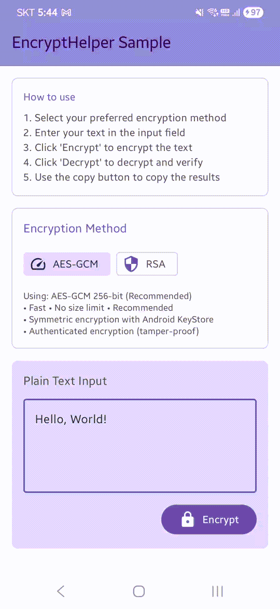

## EncryptHelper

This library offers a Encrypt & Decrypt Utils.
It uses KeyStore internally, so keys are protected by Android System.



<br />

### Including in your project
And add a dependency code to your **module**'s `build.gradle` file.
```gradle
dependencies {
    implementation 'io.groovin:EncryptHelper:x.x.x'
}
```
<br />

### How to use
Create `EncryptHelper` instance using `EncryptHelperFactory` with key alias.

```kotlin
// Using default settings (AES-GCM 256-bit, recommended)
val encryptHelper = EncryptHelperFactory.create("sample_app_key_alias")

// Or specify a KeyType
val encryptHelper = EncryptHelperFactory.create(
    keyAlias = "sample_app_key_alias",
    keyType = KeyType.AES_GCM_256
)
```

Use the `toEncrypt()`, `toDecrypt()` methods for encryption or decryption.
```kotlin
val originalText = "Hello, World!"
val encryptedText = encryptHelper.toEncrypt(originalText)
val decryptedText = encryptHelper.toDecrypt(encryptedText)
```

<br />

### KeyType Options

The library supports both **AES** and **RSA** encryption methods. The factory automatically selects the appropriate implementation based on the KeyType.

#### AES Encryption (Recommended)
- **`KeyType.AES_GCM_256`** (Default): AES-GCM with 256-bit key
  - ✅ **Recommended** for most use cases
  - ✅ Fast performance
  - ✅ No size limit for plaintext
  - ✅ Authenticated encryption (tamper-proof)
  - Uses symmetric encryption with Android KeyStore

- **`KeyType.AES_GCM_128`**: AES-GCM with 128-bit key
  - Slightly faster than 256-bit
  - Still highly secure for general use
  - Same features as AES_GCM_256

#### RSA Encryption
- **`KeyType.RSA_ECB_PKCS1_2048`**: RSA with 2048-bit key
  - ⚠️ Maximum plaintext size: ~245 bytes
  - Uses asymmetric encryption with Android KeyStore
  - Suitable for small data or key exchange

- **`KeyType.RSA_ECB_PKCS1_4096`**: RSA with 4096-bit key
  - ⚠️ Maximum plaintext size: ~501 bytes
  - Higher security than 2048-bit
  - Slower than 2048-bit

#### AES vs RSA Comparison

| Feature | AES (Symmetric) | RSA (Asymmetric) |
|---------|----------------|------------------|
| Speed | ⚡ Very Fast | 🐢 Slower |
| Data Size Limit | ✅ Unlimited | ❌ Limited (~245-501 bytes) |
| Key Type | Same key for encrypt/decrypt | Public/Private key pair |
| Use Case | General data encryption | Small data, key exchange |
| Performance | Excellent for large data | Best for small data only |

**Recommendation**: Use **AES_GCM_256** (default) for most applications. Only use RSA if you specifically need asymmetric encryption features.

<br />

### License
```xml
Copyright 2022 gaiuszzang (Mincheol Shin)

Licensed under the Apache License, Version 2.0 (the "License");
you may not use this file except in compliance with the License.
You may obtain a copy of the License at

   http://www.apache.org/licenses/LICENSE-2.0

Unless required by applicable law or agreed to in writing, software
distributed under the License is distributed on an "AS IS" BASIS,
WITHOUT WARRANTIES OR CONDITIONS OF ANY KIND, either express or implied.
See the License for the specific language governing permissions and
limitations under the License.
```
